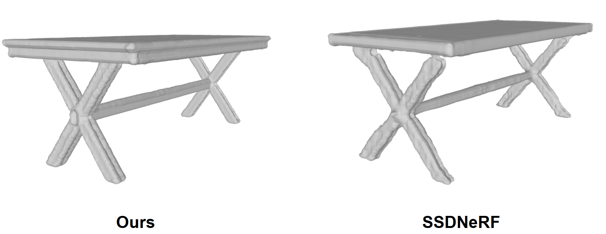

# Text-Conditioned NeRF

Pytroch implementation for UofT CSC2545 Course project.

This repository contains the implementation of Text-Conditioned Single-Stage Diffusion NeRF (SSDNeRF), a novel framework for generating 3D scenes and objects conditioned on textual descriptions. 

This repository is based on the orignal SSDNeRF Pytorch implementation: [[project page](https://lakonik.github.io/ssdnerf)] [[paper](https://arxiv.org/pdf/2304.06714.pdf)].

# Installation
## Prerequisites

The code has been tested in the environment described as follows:

- Linux (tested on Ubuntu 18.04/20.04 LTS)
- Python 3.10
- [CUDA Toolkit (12.6)](https://developer.nvidia.com/cuda-toolkit-archive)
- [PyTorch](https://pytorch.org/get-started/previous-versions/) 
- [MMCV](https://github.com/open-mmlab/mmcv) 
- [MMGeneration](https://github.com/open-mmlab/mmgeneration) 

Our instruction can work with CUDA version 12.x, if you use an earlier version of CUDA, please refer to [SSDNeRF Readme.md](https://github.com/Lakonik/SSDNeRF).

Other dependencies can be installed via `pip install -r requirements.txt`. 

An example of commands for installing the Python packages is shown below:

```bash
# Export the PATH of CUDA toolkit
export CUDA_HOME=/usr/local/cuda     //your cuda path
export PATH=$CUDA_HOME/bin:$PATH
export LD_LIBRARY_PATH=$CUDA_HOME/lib64:$LD_LIBRARY_PATH

# Create conda environment
conda create -y -n tssdnerf python=3.10
conda activate tssdnerf

# Install PyTorch (follow official instruction here: https://pytorch.org/get-started/locally/)
pip3 install torch torchvision torchaudio

# Install MMCV and MMGeneration
pip install -U openmim
mim install mmcv-full
git clone https://github.com/open-mmlab/mmgeneration && cd mmgeneration
pip install -v -e .
cd ..

# Clone this repo and install other dependencies
git clone <this repo> && cd <repo folder>
pip install -r requirements.txt
```

## Compile CUDA packages

There are two CUDA packages from [torch-ngp](https://github.com/ashawkey/torch-ngp) that need to be built locally.

```bash
cd lib/ops/raymarching/
pip install -e .
cd ../shencoder/
pip install -e .
cd ../../..
```

## Problem Shooting
You might encounter some problem with NumPy, please be sure the NumPy is under 2.0.0.

# Usage
## Data preparation
We only use ABO Table dataset in this project, for more datasets please refer to [the original SSDNeRF repo](https://github.com/Lakonik/SSDNeRF).

Download `abo_tables.zip` from [here](https://drive.google.com/file/d/1evnoO2hEz35iLbHF4DQoe-kIpnPUmPtA/view?usp=sharing). Unzip it to `./data/abo`. For convenience we have converted the ABO dataset into PixelNeRF's SRN format. Also, we added the metadata and description extracted from original abo metadata list, so one scene has the following format,

```
./
├── abo/
│   ├── tables_train/
│   │   ├── sample_name/
│   │   │   ├── pose/
│   │   │   ├── rgb/
│   │   │   ├── description.txt
│   │   │   ├── intrinsics.txt
│   │   │   └── metadata.json

…
```

Extract the downloaded archives according to the following folder tree (or use symlinks).

```
./
├── configs/
├── data/
│   ├── abo/
│   │   ├── tables_train/
│   │   └── tables_test/
├── demo/
├── lib/
├── tools/
…
```

For FID and KID evaluation, run the following commands to extract the Inception features of the real images. (This script will use all the available GPUs on your machine, so remember to set `CUDA_VISIBLE_DEVICES`.)

```bash
CUDA_VISIBLE_DEVICES=0 python tools/inception_stat.py configs/paper_cfgs/ssdnerf_abotables_uncond.py
```

## Training

Run the following command to train a model:

```bash
python train.py /PATH/TO/CONFIG --gpu-ids 0 1
```

Note that the total batch size is determined by the number of GPUs you specified. All our models are trained using RTX A6000 GPUs.

Since we adopt the density-based NeRF pruning trategy in [torch-ngp](https://github.com/ashawkey/torch-ngp), training would start slow and become faster later, so the initial esitamtion of remaining time is usually over twice as much as the actual training time.

Model checkpoints will be saved into `./work_dirs`. Scene caches will be saved into `./cache`.

## Testing and evaluation

```bash
python test.py /PATH/TO/CONFIG /PATH/TO/CHECKPOINT --gpu-ids 0 1  # you can specify any number of GPUs here
```
Some trained models can be downloaded from [here](https://drive.google.com/drive/folders/13z4C13TsofPkBuqMqQjRp5yDck7CjCiZ?usp=sharing) for testing.

To save the sampled NeRFs and extracted meshes, uncomment (or add) these lines in the `test_cfg` dict of the config file:

```python
    save_dir=work_dir + '/save',
    save_mesh=True,
    mesh_resolution=256,
    mesh_threshold=10,
```

All results will be saved into `./work_dirs/<cfg name>/save`.
You can then open the saved `.pth` NeRF scenes using the GUI tool `demo/ssdnerf_gui.py` (see below), and the `.stl` meshes using any mesh viewer.

## Visualization




#
For more information, please refer to the [SSDNeRF Readme.md](https://github.com/Lakonik/SSDNeRF)
